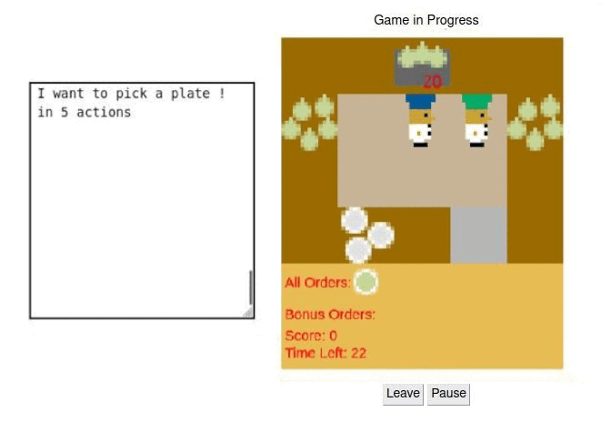

## Project : Explanability of the Overcooked-AI
  

  <!--  -->
   

 <i>Demonstration of the explanations during 6 actions.</i>
 

## Overwiew

The objective of this project is to enhance cooperation between a computer-controlled player and a human player in the Overcooked environment. We bring along the code provide in this [repo](https://github.com/HumanCompatibleAI/overcooked_ai), where you can find the settings too. And to find the instructions to run a demonstration you can go on this [repo](https://github.com/HumanCompatibleAI/overcooked-demo).

## New code contribution 

`overcooked_ai_py/mdp/`:

- `overcooked_mdp.py`: The Explanation class has been added, which allows for managing explanations.

`overcooked_demo/server/`:

- `game.py`: In this class, you can retrieve the model, the input state, and the action that has been decided by the agent to send them to the Explanation class.
- `app.py`: The Flask app where we decide wich informations will be sent to the chat box.
- `static`:
    - `js` and `templates` : contain the index.js where we add a log to print the explanations.
 
## Presentation of the contributions

 `Class Explanation`:
 
- `Method : Vision`: This method will predict the futurs actions until th AI agent want to take a concrete action.
- `Instance variable : collide` : This variable enables us to determine when the agent is obstructed by another agent and is unable to complete its objective.
 
